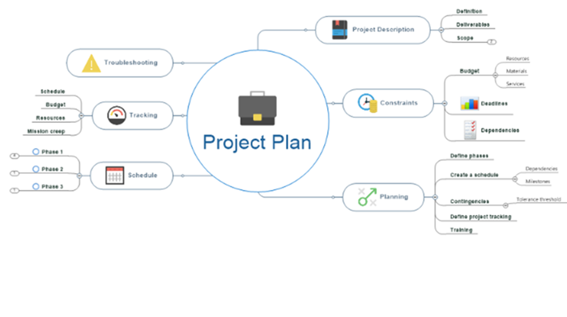

# Étapes clés pour créer une carte de projet

## 1. Définir la portée du projet
Il faut commencer par préciser les objectifs du projet.  
Identifier les tâches principales ainsi que les délais.  
Cela permet d’avoir une vision globale et d’éviter les erreurs.

## 2. Décomposer les tâches
Les grandes tâches doivent être divisées en petites sous-tâches.  
Cela facilite l’organisation et le suivi du travail.  
Les dépendances et les ressources doivent être clairement définies.

## 3. Visualiser le projet
L’utilisation de cartes mentales ou de diagrammes est recommandée.  
Ces outils rendent le projet plus clair et plus compréhensible.  
Ils aident à mieux relier les idées et les étapes.

## 4. Affiner et partager
Il est important d’ajouter les responsabilités de chaque membre.  
Les couleurs peuvent être utilisées pour définir les priorités.  
Le projet doit être mis à jour régulièrement et partagé avec l’équipe.

## Qu’est-ce qu’une Carte de Projet ?

Une carte de projet est un outil visuel qui permet de représenter les éléments essentiels d’un projet.  
Elle inclut notamment les tâches, les délais et les dépendances entre les différentes étapes.

Cet outil aide les équipes à rester organisées, à mieux planifier le travail et à garder une vision claire des objectifs.  
La carte de projet peut prendre plusieurs formes, comme une roadmap pour une vision stratégique ou une carte mentale pour le brainstorming, selon les besoins du projet.

## Exemple de carte de projet

## Outils et méthodes de base
- Utiliser des outils simples et accessibles  
- Outils gratuits : **Canva**, **Google Sheets**  
- Outils avancés : **Jira**, **Asana** (collaboration)  
- Projets avec cartes : **ArcGIS**, **Canva Maps**  
- Commencer avec un **modèle** pour gagner du temps  

---

## Variations Courantes
- **Carte mentale** : Idéale pour l'idéation, partez d’une idée centrale et créez des branches.  
- **Roadmap / Diagramme de Gantt** : Pour les timelines et dépendances, en mettant l’accent sur jalons et risques.  
Ces variations permettent d’adapter la carte à la **complexité du projet**, favorisant créativité ou précision.

---

## Exemple de Variations Courantes

## Comprendre les Cartes de Projet : Définitions et Types
- **Diagramme de Chemin Critique** : Séquence des tâches critiques, identification des retards.  
- **Matrice RACI (Responsabilités / Assignation)** : Tableau assignant les rôles pour chaque tâche.  
- **Diagramme de Gantt** : Graphique en barres des durées, dates de début/fin et chevauchements.  
- **Structure de Décomposition du Travail (WBS)** : Décomposition hiérarchique en sous-tâches pour gérer ressources et coûts.  
- **Cartes mentales** : Diagrammes radiaux pour le brainstorming.  
- **Cartes géographiques** : Visualisations personnalisées de lieux pour événements ou planification spatiale.

---

## Bénéfices de l'Utilisation des Cartes de Projet
- **Visibilité et transparence** : Alignement des parties prenantes et réduction des problèmes inattendus.  
- **Communication améliorée** : Hub central pour suivre les avancées.  
- **Décisions claires** : Objectifs et livrables bien définis.  
- **Efficacité** : Identification des goulots d’étranglement et optimisation des ressources.  
- **Assurance qualité** : Gestion des risques et respect des normes.  
- **Pour les cartes mentales** : Stimule créativité, apprentissage visuel, mémoire et résolution de problèmes.

---

## Étapes pour Créer une Roadmap de Projet
1. Définir objectifs et portée (critères SMART)  
2. Identifier les parties prenantes  
3. Recueillir et prioriser les exigences  
4. Décomposer en phases et jalons  
5. Définir tâches et activités  
6. Estimer temps et ressources  
7. Identifier les dépendances  
8. Communiquer, partager et suivre l’avancement

**Bonnes pratiques** : impliquer parties prenantes tôt, garder la carte simple et la mettre à jour régulièrement.

---

## Créer une Carte Mentale pour la Planification
- Placez l’**idée centrale** au milieu.  
- Ajoutez **branches principales et secondaires**.  
- **Connectez les idées** avec des lignes.  
- **Codez par couleur** pour organisation et mémoire.  
- Ajoutez **éléments visuels** : images, emojis, formes.  
- Astuce : capturez les idées avant de polir le visuel.

---

## Cartes Géographiques pour Projets Localisés
- Ajouter des données depuis un CSV (coordonnées).  
- Changer le fond de carte (ex. Light Gray Canvas).  
- Styliser les couches (taille, couleur, transparence).  
- Configurer pop-ups pour infos dynamiques.  
- Trier les éléments pour éviter chevauchements.  
- Enregistrer et partager la carte.  
- Pour des designs simples, Canva Maps permet un drag-and-drop rapide.

---

## Meilleures Pratiques
- Organisez avec un **flux clair**, utilisez hiérarchies et couleurs.  
- Étiquetez clairement et **mettez à jour régulièrement**.  
- Adaptez la carte à la **complexité du projet** : simple pour petites équipes, détaillée pour grandes initiatives.

---

## Conclusion
Une carte de projet permet de **rationaliser la planification**, d’**aligner l’équipe**, et de s’adapter aux changements.  
C’est un outil visuel indispensable pour **assurer succès et efficacité**.

## Les mots clés 

- **Un jalon** (ou milestone en anglais) est un point important dans le projet qui marque l’atteinte d’un objectif clé ou d’une étape importante.
- **Jira** : outil de gestion de projets techniques, suivi des tâches et des bugs en équipe.  
- **Asana** : outil de gestion de projets collaboratif pour organiser, planifier et suivre les tâches.
- **ArcGIS** : permet de créer et analyser des cartes géographiques détaillées  
  (localisation, zones, données spatiales, analyses avancées).
- **Canva Maps** : permet de créer des cartes simples et visuelles  
  (présentation, illustration, design rapide sans connaissances techniques).

